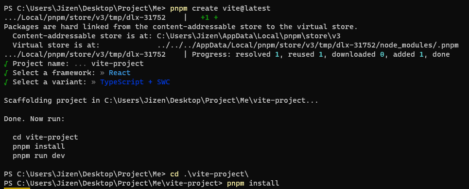

# How to set up a ReactJS Template

:::note

This is **not** a _normal_ setup. The requirements below make the setup **unique**.

- pnpm (_**faster + efficient** than npm_)
- ReactJS + Typescript
- Vite (_build **faster** than Webpack_)
- eslint + prettier
- TailwindCSS + Scss (_easy styling_)

:::

## To Set Up ReactJS + Typescript + Vite

```bash
pnpm create vite@latest
```



:::tip
Why choose Typescript + SWC (_Speedy Web Compiler_) ?
Because it's super-fast JavaScript compiler written in Rust.
:::

## To Set Up Prettier

```bash
pnpm install --save-dev --save-exact prettier
# --save-dev = install as dev dependency
# --save-exact = install exact version
```

Create a .prettierrc file in your project root directory, and
set preferred Prettier configuration

```
{
  "semi": true,
  "trailingComma": "all",
  "singleQuote": true,
  "printWidth": 80,
  "tabWidth": 2
}
```

## To Set Up Tailwind CSS + SCSS

```bash
pnpm install -D tailwindcss postcss autoprefixer
npx tailwindcss init -p

pnpm i sass --save-dev
```

Steps:

1. Change all `.css` file to `.scss` file
2. Change all `import './index.css'` to `import './index.scss'`
3. Change `import './App.css'` to `import './App.scss'`
4. Go to `./index.css`, add on the code below

```css
@tailwind base;
@tailwind components;
@tailwind utilities;
```

5. Go to `tailwind.config.js`, add on the lines

```js {4-5} showLineNumbers
/** @type {import('tailwindcss').Config} */
export default {
  content: ["./index.html", "./src/**/*.{js,ts,jsx,tsx}"],
  theme: {
    extend: {},
  },
  plugins: [],
};
```

:::info

A **github repo** for the _template_ is available [here](https://github.com/tanvoontao/react-template)

:::

References:

- [Why we need to use Vite + PNPM](https://betterprogramming.pub/3-libraries-i-use-in-most-javascript-frontend-projects-555387be69c)
- [How to setup scss with react](https://stackoverflow.com/questions/67352418/how-to-add-scss-styles-to-a-react-project)
